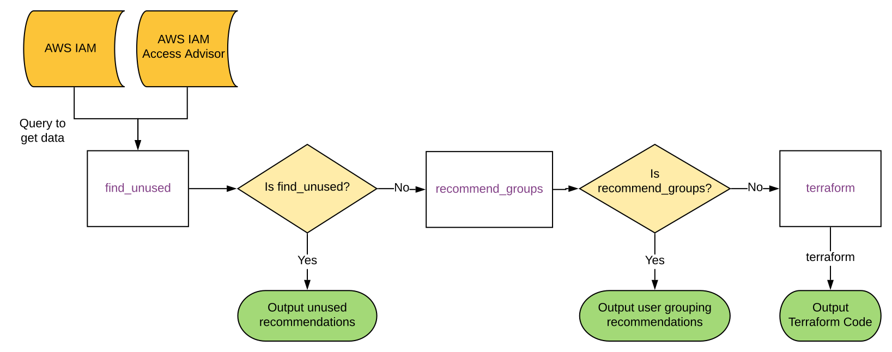

[](https://bridgecrew.io)
[](https://github.com/bridgecrewio/AirIAM/actions?query=workflow%3Abuild-and-test)

[](https://github.com/bridgecrewio/airiam/actions?query=workflow%3Abuild) 
[](https://pypi.org/project/airiam/)
[](https://pepy.tech/project/airiam)
[](https://slack.bridgecrew.io/?utm_source=github&utm_medium=organic_oss&utm_campaign=airiam)

<p align="center">
    
</p>

AirIAM is an AWS IAM to least privilege Terraform execution framework. It compiles AWS IAM usage and leverages that data to create a least-privilege IAM Terraform that replaces the exiting IAM management method.

AirIAM was created to promote immutable and version-controlled IAM management to replace today's manual and error prone methods.

## **Table of contents**

- [**Table of contents**](#table-of-contents)
- [Introduction](#introduction)
- [Features](#features)
- [Commands](#commands)
  - [Usage](#usage)
  - [Data Flow](#data-flow)
- [Examples](#examples)
- [Getting Started](#getting-started)
  - [Installation](#installation)
  - [Using Pip](#using-pip)
  - [Using brew (MacOS Only)](#using-brew-macos-only)
  - [Recommended flow](#recommended-flow)
  - [FAQ](#faq)
- [Alternatives](#alternatives)
  - [AWS IAM Cleanup Tools](#aws-iam-cleanup-tools)
  - [AWS IAM Policy Management Tools](#aws-iam-policy-management-tools)
  - [Migration of AWS to Terraform Tools](#migration-of-aws-to-terraform-tools)
- [Contributing](#contributing)
- [Support](#support)

## Introduction

AirIAM scans existing IAM usage patterns and provides a simple method to migrate IAM configurations into a right-sized
Terraform plan. It identifies unused users, roles, groups, policies and policy attachments and replaces them with a
Least Privileges Terraform code modelled to manage AWS IAM.

By moving all IAM configurations into Terraform code, admins can start tracking, auditing and modifying IAM configurations as part of their standard infrastructure-as-code development provisioning processes.

AirIAM is battle-tested and is recommended for use in Dev, QA and test environments that have been previously managed by humans. It is design to result in minimal impact on existing workloads.

If you are interested in migrating a Prod account, contact us at info@bridgecrew.io for some helpful tips.


## Features

- Detects unused IAM resources using native AWS and [Amazon Access Advisor](https://aws.amazon.com/blogs/security/identify-unused-iam-roles-remove-confidently-last-used-timestamp/) APIs.
- Provides scripts to remove unused entities en-masse.
- Effortless migration of existing IAM configurations into a simple Least Privileges Terraform model.
- Integrates with [Checkov](https://checkov.io), a static-code analysis tool for Terraform, to track unwanted configuration changes and configuration drift.


## Commands

- `find_unused` - Detects unused users, roles, groups, policies and policy attachments. It also adds links to automation scripts that could remove these entities entirely using Bridgecrew Community. [Learn more 
  about these scripts and automation](RecommendedIntegrations.md).
  ```shell script
    usage: airiam find_unused [-h] [-p PROFILE] [-l LAST_USED_THRESHOLD]
                          [--no-cache] [-o {cli}]

    optional arguments:
      -h, --help            show this help message and exit
      -p PROFILE, --profile PROFILE
                            AWS profile to be used (default: None)
      -l LAST_USED_THRESHOLD, --last-used-threshold LAST_USED_THRESHOLD
                            "Last Used" threshold, in days, for an entity to be
                            considered unused (default: 90)
      --no-cache            Generate a fresh set of data from AWS IAM API calls
                            (default: False)
      -o {cli}, --output {cli}
                            Output format (default: OutputFormat.cli)
  ```
- `recommend_groups` - Identifies what permissions are in use and creates 3 generalized groups according to that usage. Supported groups:
    - Admins - Users who have the AdministratorAccess policy attached. It will be added to the admins group which will have the managed policy `arn:aws:iam::aws:policy/AdministratorAccess` attached.
    - PowerUsers - Users who have write access to **any** of the services. In case of more than 10 policies being attached to that group, a number of groups will be created for PowerUsers, and the relevant users will be members of all of them.
    - ReadOnly - Users who only have read access to the account. Will be members of the readonly group which will have the managed policy `arn:aws:iam::aws:policy/ReadOnlyAccess` attached.
  ```shell script
    usage: airiam recommend_groups [-h] [-p PROFILE] [-o {cli}]
                                   [-l LAST_USED_THRESHOLD] [--no-cache]
    
    optional arguments:
      -h, --help            show this help message and exit
      -p PROFILE, --profile PROFILE
                            AWS profile to be used (default: None)
      -o {cli}, --output {cli}
                            Output format (default: OutputFormat.cli)
      -l LAST_USED_THRESHOLD, --last-used-threshold LAST_USED_THRESHOLD
                            "Last Used" threshold, in days, for an entity to be
                            considered unused (default: 90)
      --no-cache            Generate a fresh set of data from AWS IAM API calls
                            (default: False)
  ```
- `terraform` - Creates Terraform files based on the outputs and the transformations applied by the optional arguments supplied.

  ```shell script
    usage: airiam terraform [-h] [-p PROFILE] [-d DIRECTORY] [--without-unused]
                            [--without-groups] [-l LAST_USED_THRESHOLD]
                            [--no-cache] [--without-import]
    
    optional arguments:
      -h, --help            show this help message and exit
      -p PROFILE, --profile PROFILE
                            AWS profile to be used (default: None)
      -d DIRECTORY, --directory DIRECTORY
                            Path where the output terraform code and state will be
                            stored (default: results)
      --without-unused      Create terraform code without unused entities
                            (default: False)
      --without-groups      Create terraform code without recommendation for user
                            groups (default: False)
      -l LAST_USED_THRESHOLD, --last-used-threshold LAST_USED_THRESHOLD
                            "Last Used" threshold, in days, for an entity to be
                            considered unused (default: 90)
      --no-cache            Generate a fresh set of data from AWS IAM API calls
                            (default: False)
      --without-import      Import the resulting entities to terraform's state
                            file. Note - this might take a long time (default:
                            False)
  ```
    Important notes for `terraform` command:

    a. AirIAM replaces all hardcoded values with the matching terraform references, which results in replacements of all group memberships and policy attachments.
    If this is run using a user, please make sure the user has the relevant privileges directly attached. A matching warning will be displayed if relevant.
    
    c. AirIAM tags all the resources it touched so it will be easy to identify the entities which are not managed through AirIAM. This results in terraform modifying the relevant entities by adding these tags.
    
    d. By default, AirIAM will import the currently existing IAM entities and their relationships, which might take a while depending on the number of configurations.

### Usage

The three commands above run sequentially, and in-sync, as seen in the diagram below.

When executing, AirIAM starts by scanning a selected AWS account using the specified profile. 
If `find_unused` is specified, the results are printed and the execution completes.
If `recommend_groups` is specified, after the stage of group recommendation the results are printed and the execution completes.
If the `terraform` command is specified it takes all the results and creates the Terraform code and state file required to replace the existing IAM configuration.

### Data Flow



## Examples


## Getting Started

### Installation

### Using Pip

```cli
pip3 install airiam --user
```

### Using brew (MacOS Only)

```cli
brew tap bridgecrewio/airiam https://github.com/bridgecrewio/airiam
brew update
brew install airiam
```

### Recommended Flow
The recommended workflow for using this tool is as follows:

1. Run the `find_unused` command and delete the unused access keys + unused console logins - these cannot be migrated to terraform because they hold secrets known only to the relevant user - his password and private credentials.
2. Run the `terraform` command without any flags, creating a terraform setup that mirrors your existing IAM setup. This will take a while as all of the entities will be imported to your state file
3. Commit the terraform files (without the state file) to a new repository.
4. Run the terraform command again, this time with the flag `--without-import` and `--without-unused`. This will edit the .tf files to contain only the entities that are in use.
5. Create a new branch and commit the new terraform files.
6. Create a Pull Request / Merge Request from this branch to the default branch. Check out the differences and make sure all the changes are good. Consult relevant stakeholders in your organization if necessary.
7. After approval - merge the PR and apply the changes using terraform apply. Please note this action will require Admin IAM access to the account.

### FAQ

If you run into the following error:

```error
airiam is not recognized as an internal or external command
```

Please make sure python is in your `PATH` by running the following command:

```path
export PATH="/Users//Library/Python/3.7/bin:$PATH"
```

## Alternatives

### AWS IAM Cleanup Tools 

For AWS IAM usage scanners check out [CloudTracker](https://github.com/duo-labs/cloudtracker), [Trailscraper](https://github.com/flosell/trailscraper/), 
[Aadvark](https://github.com/Netflix-Skunkworks/aardvark) & [Repokid](https://github.com/Netflix/repokid).
The main difference between these tools and AirIAM is that AirIAM also moves the problem into static terraform code form, which allows an entire set of code analysis tools to manage and identify deviations and changes.

### AWS IAM Policy Management Tools

For static IAM policy linting, check out [Parliament](https://github.com/duo-labs/parliament). Parliament is actually integrated into AirIAM, and is run on the policies it gets from your AWS account.

For automatically creating IAM policies and managing them as code, check out  [aws-iam-generator](https://github.com/awslabs/aws-iam-generator),
[PolicySentry](https://github.com/salesforce/policy_sentry).

[Cloudsplaining](https://github.com/salesforce/cloudsplaining) is another tool from salesforce that analyzes existing IAM set-up
and identifies risky / over privileged roles.

These tools help create better policies, but do not help with existing AWS IAM set-up.

### Migration of AWS to Terraform Tools

For other tools that help migrate existing AWS IAM set-up to terraform, check out
[terracognita](https://github.com/cycloidio/terracognita/) and [terraforming](https://github.com/dtan4/terraforming).
AirIAM is the only tool which supports migrating all relevant IAM entities to terraform v0.12.

## Contributing

Contribution is welcomed!

We would love to hear about other IAM governance models for additional use cases as well as new ways to identify over-permissive IAM resources.

## Support

[Bridgecrew](https://bridgecrew.io) builds and maintains AirIAM to encourage the adoption of IAM-as-code and enforcement of IAM Rightsizing and Least Privileges best practices in policy-as-code.

Start with our [Documentation](https://bridgecrewio.github.io/airiam/) for quick tutorials and examples.

If you need direct support you can contact us at info@bridgecrew.io.
